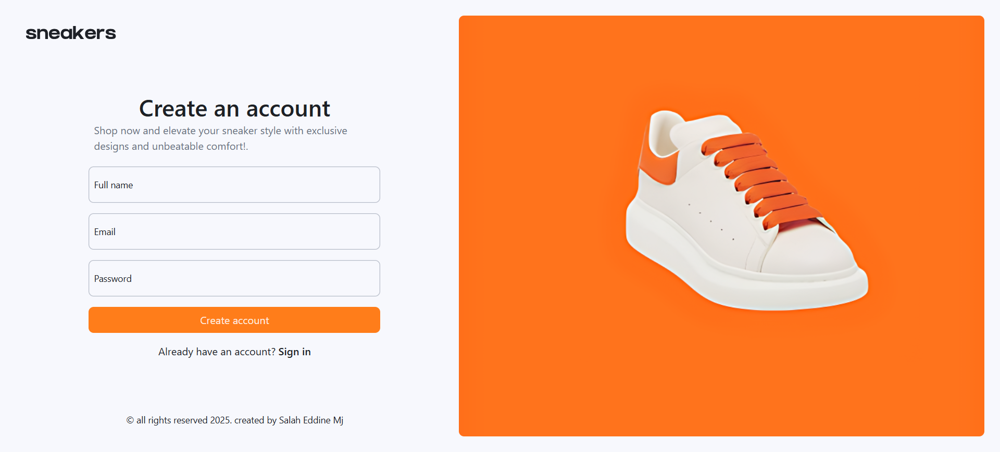
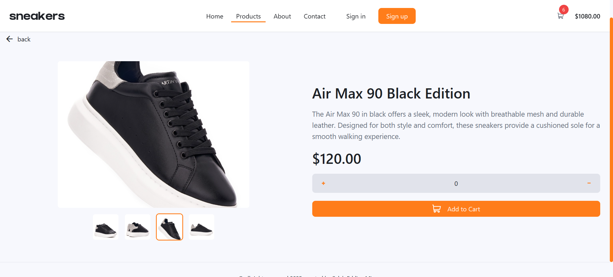
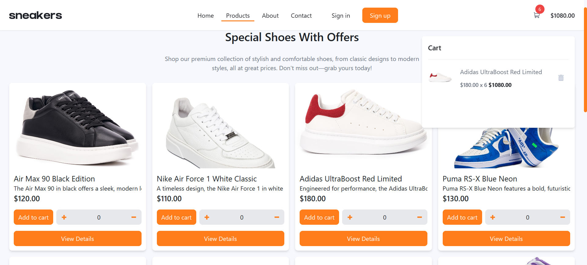
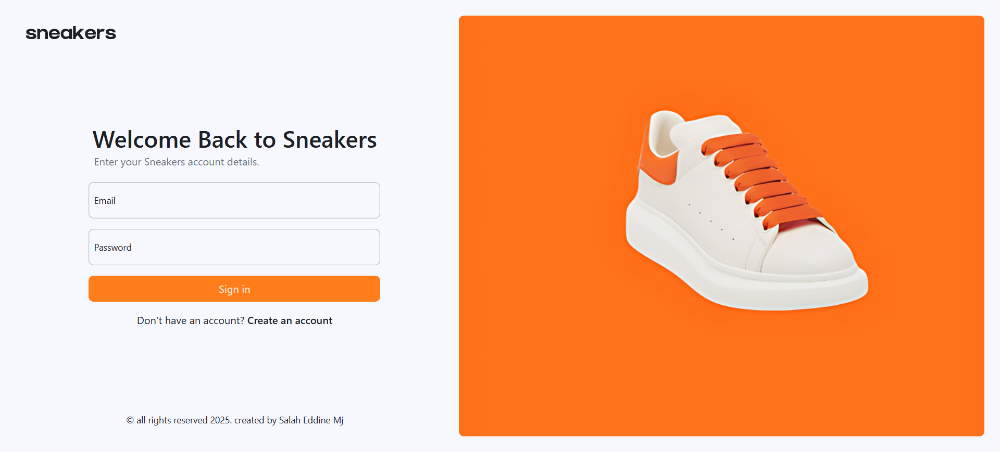
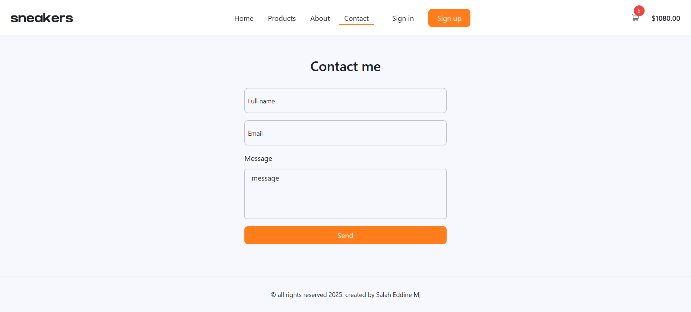

# Sneaker E-commerce Website

Welcome to the Sneaker E-commerce Website! This is an online platform where users can browse and purchase sneakers. The website is built using React, Vite, Tailwind CSS, and React Router DOM for a fast and seamless shopping experience.

## Table of Contents

- [Description](#description)
- [Built With](#built-with)
- [Getting Started](#getting-started)
- [Installation](#installation)
- [Usage](#usage)
- [Screenshots](#screenshots)
- [Contributing](#contributing)
- [License](#license)

## Description

The Sneakers E-commerce Website allows users to:

- Browse a wide range of sneakers.
- Add products to their cart.
- View product details, images, and prices.
- Proceed to checkout and complete their purchases.

This platform aims to provide a smooth and modern shopping experience with a clean and responsive design.

## Built With

This project is built with the following technologies:

* [React](https://reactjs.org/) - A JavaScript library for building user interfaces
* [Vite](https://vitejs.dev/) - A fast and optimized build tool for modern web projects
* [Tailwind CSS](https://tailwindcss.com/) - A utility-first CSS framework for rapid UI development
* [React Router DOM](https://reactrouter.com/) - A library for routing in React applications

## Getting Started

To get a local copy up and running, follow these simple steps:

1. Clone the repository:
    ```bash
    git clone https://github.com/SalahEddineMj/e-commerce.git
    ```

2. Navigate into the project directory:
    ```bash
    cd ecommerce
    ```

## Installation

1. Install dependencies:
    ```bash
    npm install
    ```

2. Run the development server:
    ```bash
    npm run dev
    ```

3. Open your browser and go to [http://localhost:5173](http://localhost:5173) to view the app.

## Usage

This project features a fully functional sneaker e-commerce website. You can:

- Browse sneakers and filter by category.
- View details of each sneaker, including images, price, and description.
- Add sneakers to your shopping cart.
- Proceed to checkout to finalize your order.

## Screenshots







## Contributing

We welcome contributions to improve the project. Please follow these steps to contribute:

1. Fork the repository.
2. Create your feature branch (`git checkout -b feature/your-feature`).
3. Commit your changes (`git commit -m 'Add new feature'`).
4. Push to the branch (`git push origin feature/your-feature`).
5. Open a pull request.

## License

This project is licensed under the MIT License - see the [LICENSE](LICENSE) file for details.

<p align="right">(<a href="#readme-top">back to top</a>)</p>
